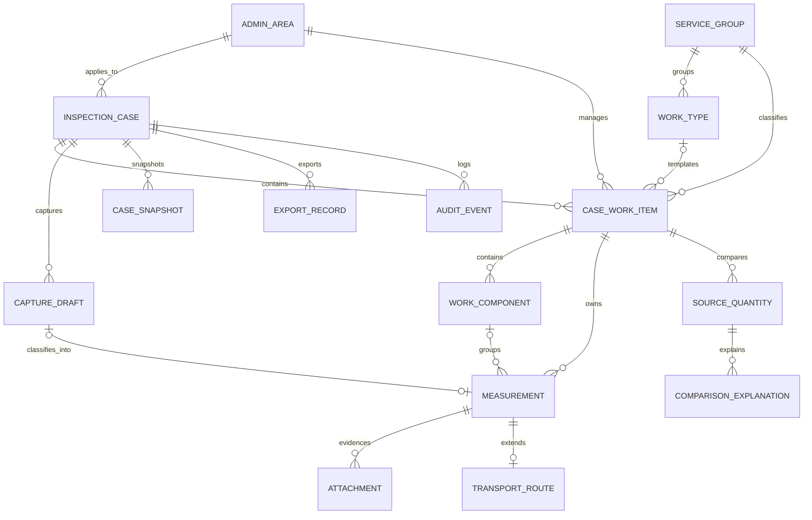

# 03. Mô hình dữ liệu

## 1. Nguyên tắc

- Một cơ sở dữ liệu chung, phân tách theo hồ sơ và quyền truy cập.
- ID dùng UUID; mã nghiệp vụ là trường riêng và có thể đọc được.
- Dữ liệu hình học lưu EPSG:4326; kết quả tính lưu cùng đơn vị chuẩn SI.
- Hỗ trợ phiên bản, xóa mềm và nhật ký chỉ thêm mới.
- Danh mục có `active_from`, `active_to` hoặc `version` để bảo toàn hồ sơ cũ.

## 2. Sơ đồ quan hệ rút gọn

## 3. Thực thể chính

### `admin_area`

Lưu địa bàn và phiên bản ranh giới. Trường chính: `id`, `code`, `name`, `area_type`, `parent_id`, `valid_from`, `valid_to`, `boundary`, `source`, `source_version`, `source_hash`.

`source_hash` là SHA-256 của đúng byte GeoJSON nguồn khi nhập qua CLI. Không ghi đè
cùng `code/source_version` nếu hash thay đổi; phải tạo phiên bản nguồn mới.

### `inspection_case`

Trường chính: `id`, `case_code`, `name`, `admin_area_id`, `period_start`, `period_end`, `inspected_entity`, `status`, `boundary_snapshot`, `created_by`, `locked_at`, `deleted_at`.

`boundary_snapshot` bảo đảm hồ sơ không thay đổi khi danh mục địa giới cập nhật.

### `service_group`

Trường chính: `id`, `code`, `name`, `display_order`, `color`, `active`.

### `work_type`

Mẫu công tác. Trường chính: `id`, `service_group_id`, `code`, `name`, `measurement_kind`, `base_unit`, `attribute_schema`, `calculation_spec`, `calculation_version`, `active`.

### `case_work_item`

Công tác cụ thể trong hồ sơ. Trường chính: `id`, `inspection_case_id`,
`management_area_id`, `service_group_id`, `work_type_id`, `name`, `period_start`,
`period_end`, `unit`, `formula_snapshot`, `warning_threshold`, `status`.

`work_type_id` là template nâng cao tùy chọn; công tác cơ bản dùng rule point/line/
area được version hóa. Tên có thể trống khi mới thu thập nhưng bắt buộc trước khi
xác nhận phép đo. Migration backfill `service_group_id` từ work type và giữ nguyên
liên kết cũ; `management_area_id` dùng lớp khu vực quản lý, không thay snapshot địa
giới hành chính của hồ sơ.

### `work_component`

Mục con thuộc công tác: `id`, `case_work_item_id`, `name`, `display_order`, `status`,
`version`, `created_by`, `deleted_at`. Một mục con chứa nhiều measurement rời nhau.
Đổi tên giữ nguyên ID; xóa mềm cha không cascade tới measurement.

### `capture_draft`

Vùng đệm đo trước khi phân loại: `id`, `inspection_case_id`, `local_id`, `device_id`,
`geometry_kind`, `method`, `raw_geometry`, `metadata`, `status`, `version`,
`classified_measurement_id`, `created_by`, `classified_at`, `deleted_at`.

Nháp không mang kết quả chính thức và không tham gia aggregate/snapshot. Khi phân
loại, máy chủ tạo/liên kết cấu trúc và measurement trong cùng transaction, sau đó
gắn `classified_measurement_id`; raw geometry của nháp không bị ghi đè.

### `measurement`

Trường chính:

- Quan hệ: `case_work_item_id`, `work_component_id`, `capture_draft_id`, `supersedes_id`.
- Nhận dạng: `code`, `name`, `version`.
- Phương pháp: `method`, `geometry_kind`, `source_device`, `source_provider`.
- Hình học: `raw_geometry`, `normalized_geometry`.
- Tính toán: `base_value`, `calculated_quantity`, `unit`, `calculation_rule_code`, `calculation_version`, `calculation_inputs`, `calculation_output`.
- Chất lượng: `gps_accuracy_m`, `validation_status`, `warnings`.
- Vòng đời: `status`, `confirmed_at`, `created_by`, `deleted_at`.

### `transport_route`

Mở rộng phép đo route: `measurement_id`, `route_source`, `provider`, `profile`, `origin`, `destination`, `waypoints`, `distance_one_way_m`, `return_factor`, `trip_count`, `waste_quantity_ton`, `weighted_distance_ton_km`, `request_fingerprint`, `provider_response_summary`.

Không lưu token hoặc toàn bộ response nếu điều kiện nhà cung cấp không cho phép; chỉ lưu phần cần thiết và được phép.

### `source_quantity`

Số liệu đối chiếu: `case_work_item_id`, `source_kind`, `document_no`, `document_date`, `quantity`, `unit`, `period_start`, `period_end`, `note`, `attachment_id`.

### `comparison_explanation`

Giải trình hiện hành cho từng nguồn: `source_quantity_id`, `explanation`,
`attachment_id`, `created_by`, `updated_by`, `deleted_at`. Partial unique index trên
bản ghi chưa xóa bảo đảm mỗi nguồn chỉ có một giải trình hiện hành.

### `case_snapshot`

Ảnh chụp dữ liệu chuẩn hóa tại thời điểm khóa hoặc xuất: `inspection_case_id`,
`snapshot_type`, `summary`, `snapshot_hash`, `created_by`. Hash tính trên biểu diễn
JSON xác định và snapshot chỉ thêm mới.

### `export_record`

Vết xuất dữ liệu: `inspection_case_id`, `snapshot_id`, `format`, `file_name`,
`file_hash`, `size_bytes`, `filters`, `created_by`, `created_at`. Không lưu URL có
chữ ký hoặc object key trong payload trả về cho người dùng.

### `attachment`

Trường chính: `id`, `measurement_id`, `case_work_item_id`, `object_key`, `original_name`, `mime_type`, `size_bytes`, `sha256`, `captured_at`, `captured_location`, `metadata`, `deleted_at`.

### `audit_event`

Nhật ký chỉ thêm mới: `id`, `inspection_case_id`, `entity_type`, `entity_id`, `action`, `actor_id`, `occurred_at`, `reason`, `before_data`, `after_data`, `trace_id`.

### `sync_mutation`

Chống trùng khi đồng bộ: `idempotency_key`, `device_id`, `entity_type`, `entity_local_id`, `payload_hash`, `status`, `server_entity_id`, `processed_at`.

## 4. Enum và danh mục chuẩn

### Trạng thái hồ sơ

`draft`, `in_progress`, `review`, `locked`, `archived`.

### Trạng thái phép đo

`draft`, `pending_validation`, `needs_attention`, `confirmed`, `superseded`, `deleted`.

### Trạng thái nháp thu thập

`unclassified`, `classifying`, `classified`, `conflict`, `deleted`.

### Phương pháp đo

`map_draw`, `gps_point`, `gps_track`, `route_provider`, `import_geojson`, `manual_document`.

### Nguồn khối lượng

`estimate`, `contract`, `reported`, `accepted`, `other`.

## 5. Ràng buộc quan trọng

- `period_end >= period_start`.
- Chỉ một bản ghi hiện hành trong chuỗi phiên bản phép đo.
- Geometry phù hợp `geometry_kind` và hợp lệ trước khi xác nhận.
- `calculated_quantity >= 0`; giá trị âm chỉ dùng ở sự kiện điều chỉnh riêng.
- Hồ sơ `locked` không cho sửa dữ liệu nghiệp vụ trực tiếp.
- `sha256` và `object_key` bắt buộc với tệp đã tải hoàn tất.
- `idempotency_key` là duy nhất theo thiết bị/nguồn đồng bộ.
- `capture_draft.classified_measurement_id` chỉ được gắn một lần; retry cùng
  idempotency/payload trả cùng measurement.
- Measurement confirmed phải có công tác hiện hành với tên không rỗng; mục con là
  tùy chọn, nhưng nếu có thì phải hiện hành và có tên không rỗng.
- Không cho lưu trữ/xóa mềm khu vực, lĩnh vực, công tác hoặc mục con còn con hoạt
  động nếu chưa chuyển con; không có cascade xóa chứng cứ.

## 6. Chỉ mục

- GIST cho boundary và geometry.
- B-tree cho `inspection_case_id`, `case_work_item_id`, trạng thái và thời gian.
- B-tree cho `work_component_id`, `capture_draft.status`, `created_by` và thời gian.
- Partial index cho bản ghi chưa xóa.
- GIN cho thuộc tính/cảnh báo JSONB khi có nhu cầu tìm kiếm thực tế.

## 7. Chính sách lưu giữ

- Không xóa cứng hồ sơ và bằng chứng trong thao tác thông thường.
- Bản nháp ngoại tuyến được dọn theo thời hạn cấu hình sau khi đồng bộ thành công.
- Bản xuất có thể xóa khỏi kho tạm nhưng sự kiện xuất và hash phải còn.
- Cấu hình thời hạn sao lưu và lưu giữ ảnh được chốt trước triển khai thật.
