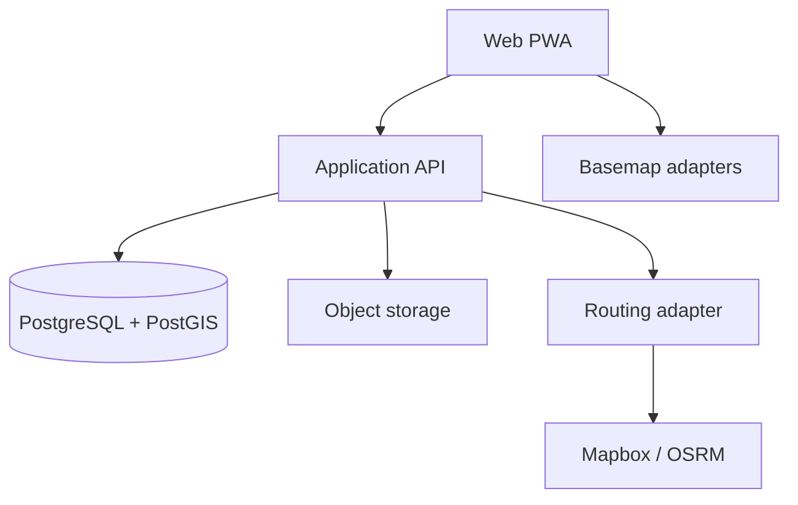

# 05. Kiến trúc hệ thống và hợp đồng API

## 1. Kiến trúc mục tiêu

Ứng dụng sử dụng kiến trúc modular monolith ở MVP. Đây là phương án đủ đơn giản cho một người dùng nhưng vẫn tách rõ nghiệp vụ để mở rộng.



## 2. Stack đề xuất

- Frontend: React + TypeScript, PWA, MapLibre GL JS, thư viện vẽ tương thích MapLibre.
- Backend: TypeScript/Node.js theo framework có validation và OpenAPI tốt.
- Database: PostgreSQL + PostGIS.
- Queue MVP: tác vụ trong tiến trình cho export nhỏ; chuẩn bị interface để chuyển sang queue thật.
- Object storage: S3-compatible.
- Authentication: một tài khoản chủ hồ sơ; thiết kế RBAC tối thiểu cho mở rộng.
- Observability: structured logs, trace ID, error reporting; không ghi dữ liệu nhạy cảm quá mức.

Không khóa phiên bản framework trong tài liệu này; repository phải pin phiên bản tại thời điểm khởi tạo và ghi ADR.

## 3. Mô-đun

### `identity`

Đăng nhập, phiên, thiết bị, vai trò.

### `cases`

Hồ sơ, trạng thái, khóa/mở khóa, snapshot ranh giới.

### `catalog`

Nhóm dịch vụ, loại công tác, đơn vị và quy tắc tính.

### `measurements`

Geometry, GPS, validation, version và tính khối lượng.

### `routing`

Cơ sở xử lý, waypoints, provider adapter, route version.

### `evidence`

Tải tệp, metadata, hash, thumbnail, liên kết đối tượng.

### `comparison`

Khối lượng nguồn, tổng hợp, chênh lệch và cảnh báo.

### `exports`

Excel, GeoJSON, manifest và nhật ký xuất.

### `audit`

Sự kiện chỉ thêm mới và truy vấn lịch sử.

### `sync`

Idempotency, mutation ngoại tuyến, xung đột phiên bản.

## 4. Adapter nhà cung cấp

### `BasemapProvider`

```ts
interface BasemapProvider {
  id: string
  getStyleDescriptor(context: UserContext): Promise<BasemapDescriptor>
  getAttribution(viewport: Viewport): Promise<Attribution[]>
  supportsOffline(): boolean
}
```

Mọi provider phải đảm bảo attribution và điều kiện cache. Không đưa khóa bí mật vào style công khai.

### `RoutingProvider`

```ts
interface RoutingProvider {
  id: string
  calculate(request: RouteRequest): Promise<RouteResult[]>
  healthcheck(): Promise<ProviderHealth>
}
```

`RouteRequest` gồm profile, origin, destination, waypoints và tùy chọn xe. `RouteResult` gồm distance, duration, geometry, legs, provider metadata và warning.

### `ObjectStorageProvider`

Quản lý tải lên, tải xuống có thời hạn, hash và xóa theo chính sách. Domain không biết cấu trúc URL thật.

### `ExportProvider`

Nhận snapshot dữ liệu đã kiểm tra và tạo tệp. Export không truy vấn tùy tiện ngoài phạm vi hồ sơ đã xác thực.

## 5. Quy ước API

- Prefix: `/api/v1`.
- JSON dùng `camelCase`; database dùng `snake_case`.
- ID là UUID.
- Thời gian ISO 8601 UTC; giao diện đổi sang múi giờ người dùng.
- Pagination: `cursor`, `limit`.
- Filter được khai báo rõ; không nhận SQL/filter tùy ý.
- Mutation ngoại tuyến gửi `Idempotency-Key`.
- Update dùng version/ETag để phát hiện ghi đè.

### Lỗi chuẩn

```json
{
  "code": "GEOMETRY_INVALID",
  "message": "Hình học chưa hợp lệ.",
  "details": { "reason": "self_intersection" },
  "traceId": "..."
}
```

## 6. Endpoint MVP

### Hồ sơ

- `GET /cases`
- `POST /cases`
- `GET /cases/{caseId}`
- `PATCH /cases/{caseId}`
- `POST /cases/{caseId}/lock`
- `POST /cases/{caseId}/unlock`

`POST /cases` có thể nhận `copyStructure.sourceCaseId` và danh sách
`copyStructure.workItemIds` để tạo hồ sơ cùng cấu trúc công tác trong một transaction.
Chỉ snapshot cấu hình được sao chép; kỳ công tác, phép đo, tuyến, ảnh, nguồn, kết quả
đối chiếu và audit của hồ sơ nguồn không được sao chép. Chi tiết tại ADR-020.

### Danh mục và công tác

- `GET /service-groups`
- `POST /service-groups`
- `GET /work-types`
- `POST /work-types`
- `POST /cases/{caseId}/work-items`
- `GET /cases/{caseId}/work-items`
- `PATCH /work-items/{workItemId}`

### Phép đo

- `POST /work-items/{workItemId}/measurements`
- `GET /work-items/{workItemId}/measurements`
- `GET /measurements/{measurementId}`
- `POST /measurements/{measurementId}/validate`
- `POST /measurements/{measurementId}/confirm`
- `POST /measurements/{measurementId}/supersede`
- `DELETE /measurements/{measurementId}` — xóa mềm.

### Route

- `GET /treatment-facilities`
- `POST /treatment-facilities`
- `POST /routes/calculate`
- `POST /work-items/{workItemId}/routes`
- `POST /routes/{routeId}/recalculate`
- `POST /routes/weighted-distance`

### Nguồn và đối chiếu

- `POST /work-items/{workItemId}/source-quantities`
- `GET /cases/{caseId}/comparison`
- `POST /cases/{caseId}/comparison/recalculate`

Trong Mốc 5, comparison được tính trực tiếp từ measurement `confirmed`, không cần
cache/recalculate. Ngưỡng công tác ghi đè ngưỡng hồ sơ; nguồn bằng 0 không tính tỷ lệ.

### Ảnh/tệp

- `POST /attachments/presign`
- `POST /attachments/complete`
- `GET /work-items/{workItemId}/attachments` — chỉ ảnh `completed` thuộc công tác.
- `DELETE /attachments/{attachmentId}` — xóa mềm.

### Hiện trường và đồng bộ Mốc 4

- `POST /work-items/{workItemId}/gps-tracks` — yêu cầu `Idempotency-Key` và `X-Device-Id`.
- `POST /work-items/{workItemId}/gps-points` — ghi vị trí hiện tại và accuracy,
  dùng cùng cơ chế idempotency.
- GPS raw lưu từng point và segment; normalized geometry không thay thế raw.
- `POST /attachments/presign` chỉ tạo bản ghi `pending` và URL MinIO có hạn.
- `POST /attachments/complete` đọc lại object, xác minh size/MIME/SHA-256 rồi mới
  chuyển `completed`.
- Service worker chỉ cache app shell/tài nguyên same-origin được kiểm soát; không
  cache API hoặc basemap.

### Nhập/xuất và nhật ký

- `POST /imports/geojson`
- `POST /cases/{caseId}/exports/excel`
- `POST /cases/{caseId}/exports/geojson`
- `GET /exports/{exportId}`
- `GET /cases/{caseId}/audit-events`

### Snapshot và export Mốc 5

- `POST /cases/{caseId}/lock`, `POST /cases/{caseId}/unlock` — bắt buộc lý do.
- Khóa tạo snapshot hash trước khi đổi trạng thái; mutation nghiệp vụ bị từ chối khi khóa.
- `POST /cases/{caseId}/exports/excel` — workbook năm sheet.
- `POST /cases/{caseId}/exports/geojson` — FeatureCollection dùng geometry chính thức.
- Chỉ hồ sơ `locked` được xuất để dataset không đổi giữa bước dựng tệp và snapshot.
- Mỗi tệp có `X-File-Sha256`, export record, snapshot ID và audit; không xuất secret/object key.
- UI chỉ cho liên kết nguồn/giải trình với attachment `completed` trả về từ công tác;
  API kiểm tra lại quan hệ và trạng thái trong transaction.

## 7. Luồng lưu phép đo

1. Client tạo `localId` và `idempotencyKey`.
2. Client gửi raw geometry, thuộc tính và metadata.
3. API xác thực quyền và schema.
4. PostGIS kiểm tra geometry, chuẩn hóa bản sao và tính kết quả.
5. Validation engine sinh warning/error.
6. API lưu measurement, calculation output và audit event trong một transaction.
7. Client nhận server ID, version và kết quả chính thức.

## 8. Luồng tính route

1. API kiểm tra số waypoint và cấu hình provider.
2. Adapter gọi provider; token chỉ tồn tại phía được phép.
3. Chuẩn hóa kết quả về model chung.
4. Tính fingerprint từ input + provider + profile, không gồm token.
5. Trả các phương án cho người dùng chọn.
6. Khi lưu, route gắn với measurement và không ghi đè phiên bản cũ.

Trong Mốc 3, thao tác lưu gọi provider lại ở backend và nhận `candidateIndex`; API
không nhận geometry/distance chính thức từ trình duyệt. Local/test dùng provider
xác định mang nhãn `local-deterministic`. Mapbox Directions v5 chỉ được bật khi
backend có token qua secret môi trường. Chi tiết tại ADR-014.

## 9. Triển khai

Môi trường tối thiểu:

- `local`: container database và storage giả lập.
- `staging`: khóa API thử nghiệm, dữ liệu mẫu, không dùng dữ liệu nhạy cảm thật.
- `production`: sao lưu, quota, giám sát, HTTPS và khóa giới hạn.

CI thực hiện lint, typecheck, test, migration check, build và dependency scan. Production chỉ triển khai từ artifact đã qua CI.

### Hardening và cổng Mốc 6

- API trả CSP/frame/content-type/referrer/permissions headers và `Cache-Control:
  private, no-store`; HSTS chỉ bật cùng secure cookie/HTTPS.
- Login giới hạn theo IP bằng cửa sổ trượt cấu hình qua
  `LOGIN_REQUESTS_PER_MINUTE`; route và export giữ quota theo người dùng.
- Không bật CORS rộng trong API MVP; web gọi same-origin qua reverse proxy.
- CI chạy thêm benchmark 10.000 geometry/XLSX và backup/restore drill cô lập.
