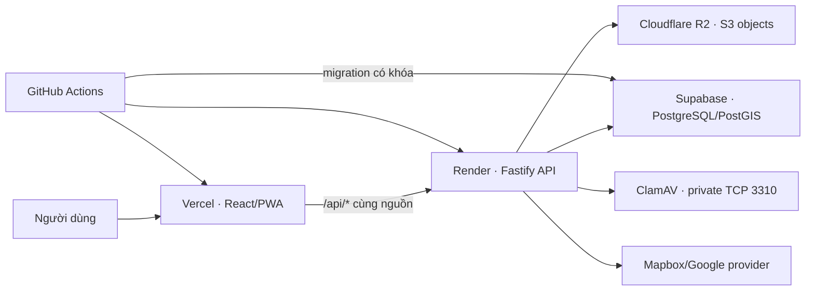

# 14. Kế hoạch triển khai ứng dụng lên Internet

## 1. Mục tiêu và phạm vi

Tài liệu này là kế hoạch đưa ứng dụng kiểm tra khối lượng hiện trường từ môi trường
local lên **staging**, sau đó mới phát hành **production**. Kiến trúc mục tiêu đã
thống nhất:

- **Vercel**: web/PWA React–Vite và reverse proxy cùng nguồn cho `/api/*`.
- **Render**: API Fastify chạy dưới dạng Web Service lâu dài.
- **Supabase**: PostgreSQL + PostGIS, không dùng Supabase Auth trong giai đoạn đầu.
- **Cloudflare R2**: ảnh gốc, thumbnail và tệp export qua giao thức S3.
- **ClamAV**: dịch vụ riêng trong private network của Render, API kết nối bằng TCP.
- **GitHub Actions**: cổng kiểm thử trước khi triển khai và migration có kiểm soát.

Mục tiêu đầu tiên là có một URL staging dùng được trên máy tính, iPad và điện thoại,
không đưa dữ liệu nghiệp vụ thật vào hệ thống cho tới khi hoàn thành restore drill,
field test và checklist bảo mật.

## 2. Quyết định kiến trúc triển khai



### 2.1. Vì sao không deploy toàn bộ trực tiếp lên Vercel ngay

Vercel có thể chạy Fastify dưới dạng một Function, nhưng bản hiện tại có các đặc
điểm phù hợp hơn với dịch vụ Node chạy thường trực:

- API hiện gọi `app.listen()` và quản lý vòng đời kết nối database.
- Quét ảnh dùng kết nối TCP trực tiếp tới ClamAV.
- Tác vụ export có trạng thái bền và cơ chế phục hồi khi API khởi động lại.
- Ảnh tải thẳng bằng URL ký cần kiểm tra tương thích CORS/S3 của R2.

Vì vậy giai đoạn đầu chỉ deploy web lên Vercel. Việc chuyển API sang Vercel Function
là một tối ưu riêng sau khi đã tách scanner/job và kiểm chứng giới hạn runtime.

### 2.2. Vai trò của Supabase

Supabase **không bắt buộc**, nhưng được chọn làm PostgreSQL quản lý sẵn. Ứng dụng
vẫn truy cập database qua Kysely/`pg` và `DATABASE_URL`; không gọi bảng trực tiếp từ
trình duyệt, không dùng `anon key`, không thay cookie session hiện tại bằng Supabase
Auth. PostGIS phải được bật trước khi chạy migration.

### 2.3. Nguyên tắc phát hành

1. Staging và production là hai bộ tài nguyên tách biệt.
2. Không dùng `.env.example` cho cloud và không commit secret.
3. Migration chạy một lần trong release job, không chạy đồng thời ở mọi API instance.
4. Không chạy seed local nguyên trạng trên production.
5. Chỉ measurement đã xác nhận mới tham gia tổng chính thức như thiết kế hiện tại.
6. Ảnh chưa quét sạch không được trở thành bằng chứng hợp lệ.
7. Production chỉ mở sau khi backup và restore staging đã được chứng minh.

## 3. Tên môi trường và tài nguyên

| Thành phần | Staging | Production |
| --- | --- | --- |
| Git branch | `codex/map-first-workflow` hoặc nhánh release | `main` đã bảo vệ |
| Vercel project | `dove-web-staging` | `dove-web-production` |
| Render API | `dove-api-staging` | `dove-api-production` |
| Render ClamAV | `dove-clamav-staging` | `dove-clamav-production` |
| Supabase project | `dove-staging` | `dove-production` |
| R2 bucket | `dove-evidence-staging` | `dove-evidence-production` |
| Domain đề xuất | `staging.<domain>` | `app.<domain>` |
| API nội bộ | Render staging URL | `api.<domain>` hoặc Render production URL |

Nếu chưa có tên miền, dùng URL do Vercel/Render cấp ở staging. Trước production phải
có domain chính thức để giới hạn Mapbox token, cấu hình cookie và lập danh sách origin.

## 4. Giai đoạn 0 — Chuẩn bị tài khoản và quyền

**Người phụ trách:** chủ dự án. **Thời lượng dự kiến:** 0,5 ngày.

- [ ] Bật 2FA cho GitHub, Vercel, Render, Supabase và Cloudflare.
- [ ] Tạo nhóm/project cloud thuộc tài khoản của cơ quan hoặc chủ dự án, không phụ
      thuộc tài khoản cá nhân của người triển khai.
- [ ] Chọn region gần Việt Nam nhất có thể cho Render và Supabase; đo latency thực tế
      trước khi chốt vì API nên ở gần database.
- [ ] Chuẩn bị domain và quyền chỉnh DNS.
- [ ] Chốt email chủ hồ sơ production; tạo mật khẩu ngẫu nhiên trong password manager.
- [ ] Tạo danh sách người có quyền xem secret, deploy, backup và mở khóa production.
- [ ] Xác nhận ngân sách tối thiểu cho dịch vụ luôn chạy, database, dung lượng ảnh,
      băng thông tile và backup ngoài nhà cung cấp.

**Cổng hoàn thành:** có chủ sở hữu, region, domain dự kiến và ma trận quyền được ghi nhận.

## 5. Giai đoạn 1 — Làm mã nguồn sẵn sàng cho cloud

**Người phụ trách:** phát triển. **Thời lượng dự kiến:** 1–2 ngày.

### 5.1. Web/Vercel

- [ ] Thêm cấu hình build riêng cho `apps/web` trong monorepo.
- [ ] Tạo `vercel.json` để SPA fallback về `index.html` và reverse proxy `/api/*`
      tới API Render staging/production.
- [ ] Không đổi `apps/web/src/api.ts` sang URL tuyệt đối; tiếp tục gọi `/api/v1` để
      cookie session và CSRF cùng nguồn.
- [ ] Xác nhận service worker không cache API, Google tile hoặc URL upload ký.
- [ ] Đặt CSP phù hợp cho Vercel: `connect-src`, `img-src`, worker, MapLibre,
      Mapbox/Google/Esri và R2 upload URL; không dùng wildcard nếu tránh được.
- [ ] Kiểm tra URL preview của Vercel không được dùng chung database production.

### 5.2. API/Render

- [ ] Tạo Dockerfile production đa giai đoạn, pin Node 24.18.0 và pnpm 11.9.0.
- [ ] Build `@dove/contracts` và `@dove/api`, chạy bằng `node dist/server.js`.
- [ ] Chạy API bằng user không phải root, bật health check
      `/api/v1/health/ready` và shutdown có kiểm soát.
- [ ] Đặt `API_HOST=0.0.0.0`; nhận cổng từ Render và ánh xạ an toàn sang `API_PORT`.
- [ ] Tách lệnh release `db:migrate` khỏi lệnh start API.
- [ ] Giới hạn connection pool theo số instance và giới hạn Supabase; không để mỗi
      instance dùng pool mặc định quá lớn.
- [ ] Kiểm tra kích thước image do `sharp`, ExcelJS và native Argon2 tạo ra.

### 5.3. Seed và bootstrap

Seed hiện tại phục vụ local/test, có tài khoản giả và dữ liệu mẫu. Trước cloud phải:

- [ ] Tách `seed:catalog` chỉ nạp danh mục hệ thống đã duyệt.
- [ ] Tách `bootstrap:owner` chỉ tạo chủ hồ sơ từ secret production và có cơ chế
      chạy một lần/idempotent.
- [ ] Không đưa `owner@example.local`, `local-demo-password`, địa bàn fixture hoặc
      cơ sở xử lý giả vào staging dùng thử chính thức/production.
- [ ] Import địa giới bằng pipeline có checksum; ghi rõ dữ liệu 75 xã/phường hiện
      vẫn là hình học tham khảo nếu chưa có hồ sơ pháp lý thay thế.

### 5.4. Object storage/R2

- [ ] Kiểm thử `minio` client hiện tại với endpoint R2: bucket exists, PUT ký, stat,
      GET, thumbnail và delete.
- [ ] Nếu có khác biệt chữ ký/CORS, tạo `ObjectStorageProvider` R2/S3 riêng; component
      nghiệp vụ không gọi SDK trực tiếp.
- [ ] Cấu hình CORS bucket chỉ cho domain staging/production, method `PUT`, header
      content type cần thiết và thời hạn URL ký ngắn.
- [ ] Tách key staging/production; key chỉ có quyền trên đúng bucket.
- [ ] Thiết lập lifecycle cho `exports/`; không tự hết hạn `evidence/` và ảnh gốc.

### 5.5. ClamAV

- [ ] Tạo dịch vụ ClamAV riêng trong private network Render.
- [ ] Không công khai cổng 3310 ra Internet.
- [ ] API dùng hostname private qua `CLAMAV_HOST`; giữ fail-closed cho hoàn tất ảnh.
- [ ] Health check bằng `PING`, kiểm mẫu sạch và EICAR trong staging.

**Cổng hoàn thành:** build Docker và Vercel chạy local/preview; không có secret trong
repository; test upload R2 và scanner đều đạt.

## 6. Giai đoạn 2 — Tạo Supabase PostgreSQL/PostGIS

**Thời lượng dự kiến:** 0,5–1 ngày.

1. Tạo project staging ở region đã chọn.
2. Lưu database password trong password manager, không gửi qua chat/ticket.
3. Bật PostGIS và xác minh:

   ```sql
   SELECT extversion FROM pg_extension WHERE extname = 'postgis';
   SELECT PostGIS_Full_Version();
   ```

4. Dùng connection string TLS. Tách:
   - **Direct/session connection:** migration, import địa giới, backup/restore.
   - **Runtime connection:** ưu tiên direct nếu Render kết nối IPv6 ổn định; nếu
     cần IPv4 thì dùng Supavisor **session mode** cho backend chạy lâu dài. Chỉ dùng
     transaction mode nếu đã tắt prepared statement và integration test đạt.
5. Giới hạn quyền runtime; tài khoản migration có quyền DDL không dùng cho request
   thường ngày nếu Supabase cho phép cấu hình phù hợp.
6. Chạy migration trên database trống, sau đó chạy migration tiến/lùi trên database
   staging tạm theo test plan.
7. Chạy bootstrap/danh mục đã tách ở Giai đoạn 1.
8. Xác minh SRID 4326, `ST_IsValid`, geography length/area và timezone UTC.

**Không làm:** đặt service-role/DB password vào biến `VITE_*`, gọi Supabase trực tiếp
từ React hoặc bật quyền truy cập bảng nghiệp vụ cho `anon`.

## 7. Giai đoạn 3 — Tạo Cloudflare R2

**Thời lượng dự kiến:** 0,5 ngày sau khi adapter đã đạt kiểm thử.

- Tạo bucket staging, tắt truy cập công khai.
- Tạo S3 API token theo nguyên tắc tối thiểu.
- Thiết lập CORS cho Vercel staging và localhost dùng kiểm thử có kiểm soát.
- Điền endpoint, access key, secret key và bucket vào Render, không điền vào Vercel web.
- Upload ảnh mẫu, hoàn tất qua API, xác minh SHA-256, MIME, kích thước, trạng thái
  scanner và thumbnail.
- Kiểm tra xóa mềm không xóa object; chỉ quy trình retention được duyệt mới xóa vật lý.
- Tạo bản sao backup độc lập cho evidence; backup database không bao gồm object R2.

## 8. Giai đoạn 4 — Deploy API và ClamAV lên Render

**Thời lượng dự kiến:** 1 ngày.

### 8.1. Biến môi trường API

| Biến | Bắt buộc | Nguồn | Ghi chú |
| --- | --- | --- | --- |
| `DATABASE_URL` | Có | Supabase | TLS; runtime pool đã kiểm thử |
| `API_HOST` | Có | Cấu hình | `0.0.0.0` |
| `API_PORT` | Có | Render | adapter nhận port nền tảng |
| `LOG_LEVEL` | Có | Cấu hình | `info`, không log secret/tọa độ thừa |
| `COOKIE_SECURE` | Có | Cấu hình | `true` trên staging/production HTTPS |
| `SESSION_TTL_HOURS` | Có | Cấu hình | bắt đầu 12 giờ, rà soát chính sách |
| `LOGIN_REQUESTS_PER_MINUTE` | Có | Cấu hình | giữ hoặc siết sau load test |
| `MINIO_ENDPOINT` | Có | R2 | hostname S3, không gồm secret |
| `MINIO_PORT` | Có | R2 | `443` |
| `MINIO_USE_SSL` | Có | R2 | `true` |
| `MINIO_BUCKET` | Có | R2 | bucket đúng môi trường |
| `MINIO_ROOT_USER` | Có | R2 | S3 access key, giữ tên biến tương thích |
| `MINIO_ROOT_PASSWORD` | Có | R2 | S3 secret key |
| `CLAMAV_HOST` | Có | Render private DNS | không dùng IP public |
| `CLAMAV_PORT` | Có | Cấu hình | `3310` |
| `CLAMAV_TIMEOUT_MS` | Có | Cấu hình | bắt đầu `30000` |
| `CLAMAV_VERSION` | Có | Image pin | khớp image thực tế |
| `ROUTING_PROVIDER` | Có | Cấu hình | `mapbox` khi chạy thật |
| `MAPBOX_ACCESS_TOKEN` | Khi mapbox | Secret | server token giới hạn API/quota |
| `GOOGLE_MAP_TILES_API_KEY` | Tùy chọn | Secret | chỉ backend, giới hạn API/IP/quota |

Các biến `BOOTSTRAP_OWNER_*` chỉ được cấp cho job bootstrap một lần, sau đó gỡ khỏi
runtime API nếu không còn cần.

### 8.2. Trình tự deploy

1. Deploy ClamAV, chờ signature database sẵn sàng.
2. Chạy migration job với direct database URL.
3. Chạy catalog seed và bootstrap owner đã tách.
4. Deploy API, cấu hình health check `/api/v1/health/ready`.
5. Kiểm `/health/live`, `/health/ready`, login rate limit và log trace ID.
6. Scale/restart thử một lần; xác minh export job và database connection phục hồi.

## 9. Giai đoạn 5 — Deploy web lên Vercel

**Thời lượng dự kiến:** 0,5–1 ngày.

- Import repository `thanhsonla/dovethanhtra` vào Vercel.
- Root Directory: `apps/web`, đồng thời bật truy cập source ngoài thư mục để dùng
  workspace package `@dove/contracts`.
- Install command: `pnpm install --frozen-lockfile`.
- Build command: `pnpm --filter @dove/web build` hoặc lệnh đã xác minh trong preview.
- Output directory: `dist` của `apps/web`.
- Pin Node 24.x và pnpm 11.9.0 theo repository.
- Cấu hình reverse proxy `/api/*` tới API Render đúng môi trường.
- Chỉ đặt public browser variables ở Vercel:

| Biến Vercel web | Loại | Yêu cầu |
| --- | --- | --- |
| `VITE_MAPBOX_PUBLIC_TOKEN` | Public | giới hạn domain/API/quota |
| `VITE_BASEMAP_STYLE_URL` | Public | tùy chọn, HTTPS và được cấp phép |
| `VITE_BASEMAP_LABEL` | Public | phải đi cùng style URL |
| `VITE_BASEMAP_ATTRIBUTION` | Public | bắt buộc khi có style URL |

Không đặt `DATABASE_URL`, R2 secret, Mapbox server token, Google Map Tiles key hoặc
Supabase database password vào Vercel web.

Sau deploy, xác minh `Set-Cookie`, CSRF, đăng nhập/đăng xuất và upload ảnh đều chạy
qua origin Vercel. Không phát hành nếu cookie bị chuyển thành cross-site ngoài dự kiến.

## 10. Giai đoạn 6 — CI/CD và quy trình migration

**Thời lượng dự kiến:** 1 ngày.

### 10.1. Pull request

Mọi PR phải đạt:

```bash
pnpm format:check
pnpm lint
pnpm typecheck
pnpm test
pnpm build
pnpm bundle:check
pnpm audit --audit-level high
```

Thay đổi API/database phải chạy integration và migration test. Thay đổi UI nghiệp
vụ phải chạy E2E Chromium và WebKit/iPad.

### 10.2. Staging

- Merge vào nhánh staging hoặc gắn tag release candidate.
- CI build image theo commit SHA, không dùng tag `latest` làm bằng chứng phát hành.
- Chạy migration job một lần với advisory lock hoặc cơ chế khóa release.
- Deploy API staging, sau đó web staging.
- Chạy smoke test và lưu URL/commit/migration version trong release record.

### 10.3. Production

- Chỉ cho phép từ commit/tag đã chạy staging.
- Yêu cầu phê duyệt thủ công trước migration và deploy production.
- Chụp backup database và xác nhận backup object trước migration.
- Migration phải backward-compatible với phiên bản API đang chạy trong cửa sổ deploy.
- Deploy API trước, web sau; theo dõi error rate và health tối thiểu 30 phút.

## 11. Giai đoạn 7 — Kiểm thử staging bắt buộc

**Thời lượng dự kiến:** 1–2 ngày, chưa tính field test thực địa.

### 11.1. Smoke test chức năng

- [ ] Đăng nhập, đăng xuất, session hết hạn và CSRF.
- [ ] Mở bản đồ, đổi nền, xem ranh giới và attribution.
- [ ] Vẽ Điểm/Tuyến/Vùng; số chính thức do PostGIS trả về.
- [ ] Thêm nhiều phần, tổng đúng và chọn dữ liệu ngoài viewport tự định vị.
- [ ] Đổi màu, sửa tên/khu vực/dịch vụ, supersede và audit.
- [ ] GPS offline → online, queue idempotent không tạo bản ghi trùng.
- [ ] Upload ảnh từ file và camera, quét sạch, thumbnail và hash.
- [ ] EICAR bị chặn và scanner không sẵn sàng phải fail-closed.
- [ ] Route Mapbox, timeout/quota/no-route và fallback thông báo đúng.
- [ ] Export Excel/GeoJSON, tải xuống, SHA-256 và audit.
- [ ] Khóa/mở khóa hồ sơ, quyền owner và IDOR.

### 11.2. Bộ mẫu đo chuẩn

- Tuyến 1 km.
- Polygon 1 ha.
- Polygon tự cắt không hợp lệ.
- Tuyến trùng.
- Tuyến qua ranh giới.
- Route không tìm được đường.

### 11.3. Thiết bị và hiệu năng

- Chromium desktop, Safari/WebKit iPad và điện thoại thật.
- Mạng 4G yếu, mất mạng, tải lại trang và PWA install.
- 10.000 geometry, export lớn và upload ảnh gần giới hạn kích thước.
- Đo p95 API, cold start, database connection, dung lượng bundle và latency Việt Nam.

### 11.4. Bảo mật

- HTTPS/HSTS, secure cookie, CSP, CORS, rate limit và upload policy.
- Secret scan, dependency audit và kiểm không có URL ký/token trong log.
- R2 bucket private; URL ký hết hạn; API không trả object key không cần thiết.
- Mapbox/Google key giới hạn đúng domain, IP, API và quota cảnh báo.

## 12. Backup, restore và quan sát

### 12.1. Mục tiêu ban đầu

- RPO: tối đa 24 giờ.
- RTO: tối đa 8 giờ.
- Retention chi tiết phải được chủ dự án phê duyệt trước production.

### 12.2. Database

- Bật backup Supabase phù hợp gói dịch vụ.
- Tạo thêm `pg_dump` định kỳ ra kho mã hóa độc lập với Supabase.
- Mỗi tháng restore vào project/database tạm và ghi số bản ghi, PostGIS version,
  checksum/snapshot cùng thời gian RTO thực tế.

### 12.3. Object

- Lập inventory `evidence/`, thumbnail và export; đối chiếu với bảng attachment.
- Sao chép ảnh gốc sang bucket/tài khoản thứ hai theo chính sách backup.
- Không coi backup database là backup ảnh.
- Kiểm hash khi restore và giữ ảnh gốc tách khỏi thumbnail.

### 12.4. Theo dõi

- Uptime check cho `/health/live` và `/health/ready`.
- Cảnh báo error rate, latency, database connection, dung lượng DB/R2, scanner lỗi,
  job export quá hạn, Mapbox/Google quota và backup thất bại.
- Log có trace ID nhưng không ghi secret, URL ký, password hoặc tọa độ thừa.

## 13. Cutover production

### 13.1. Điều kiện Go

- [ ] Tất cả CI và staging smoke test đạt.
- [ ] Restore staging thành công trong RTO.
- [ ] Field test thiết bị/địa bàn có người xác nhận.
- [ ] Dữ liệu ranh giới và cơ sở xử lý đã được duyệt; fixture không còn.
- [ ] Domain, HTTPS, cookie, CSP/CORS và key restriction đã kiểm.
- [ ] EICAR bị chặn, ảnh sạch đi qua, R2 backup hoạt động.
- [ ] Không có Critical/High chưa chấp thuận từ dependency/secret scan.
- [ ] Có người nhận cảnh báo và người có quyền rollback.

### 13.2. Trình tự

1. Đóng băng thay đổi không liên quan.
2. Backup database/object và lưu manifest.
3. Chạy migration production.
4. Bootstrap catalog/owner nếu là lần đầu.
5. Deploy API theo commit SHA.
6. Chạy health/smoke API.
7. Deploy web cùng commit SHA.
8. Chạy smoke test trình duyệt và thiết bị thật.
9. Theo dõi 30–60 phút, ghi release record.

### 13.3. Rollback

- Web: rollback Vercel về deployment trước.
- API: rollback Render về image SHA trước nếu schema vẫn tương thích.
- Database: ưu tiên forward-fix; chỉ chạy down migration khi migration đã chứng minh
  reversible và không vi phạm guard bảo toàn chứng cứ.
- Nếu nghi mất toàn vẹn: dừng mutation, khóa hồ sơ liên quan, giữ snapshot/hash và
  backup trước khi can thiệp.

## 14. Thứ tự công việc đề xuất

| Mã | Công việc | Phụ thuộc | Dự kiến | Kết quả |
| --- | --- | --- | --- | --- |
| DEP-01 | Tạo tài khoản, region, domain, quyền | Không | 0,5 ngày | Ma trận tài nguyên |
| DEP-02 | Docker hóa API và release command | DEP-01 | 1 ngày | Image production |
| DEP-03 | Tách seed catalog/bootstrap owner | DEP-02 | 0,5 ngày | Seed cloud an toàn |
| DEP-04 | Kiểm/tạo adapter R2 và CORS | DEP-01 | 1 ngày | Upload/scan đạt |
| DEP-05 | Tạo Supabase staging + migration | DEP-02,03 | 0,5 ngày | DB PostGIS staging |
| DEP-06 | Deploy ClamAV + API Render | DEP-04,05 | 0,5–1 ngày | API staging healthy |
| DEP-07 | Cấu hình Vercel + proxy same-origin | DEP-06 | 0,5 ngày | URL web staging |
| DEP-08 | CI/CD và migration lock | DEP-05,06,07 | 1 ngày | Release pipeline |
| DEP-09 | Smoke, security, performance | DEP-08 | 1–2 ngày | Biên bản staging |
| DEP-10 | Backup/restore drill | DEP-05,04 | 1 ngày | RPO/RTO thực tế |
| DEP-11 | Field test | DEP-09 | Theo lịch | Biên bản thiết bị |
| DEP-12 | Production cutover | DEP-10,11 | 0,5 ngày | URL production |

Tổng thời gian kỹ thuật ước tính: **7–10 ngày làm việc**, chưa gồm thời gian mua
dịch vụ, cấp domain, thẩm định dữ liệu địa giới và field test thực địa.

## 15. Việc chủ dự án cần cung cấp

- Domain hoặc xác nhận tạm dùng domain Vercel.
- Tài khoản/quyền Vercel, Render, Supabase và Cloudflare có 2FA.
- Email chủ hồ sơ production; password tự tạo trong password manager.
- Quyết định region và ngân sách dịch vụ.
- Mapbox/Google key production đã giới hạn hoặc quyết định chỉ dùng nền không cần key.
- Nguồn ranh giới/cơ sở xử lý được phép dùng production.
- Người duyệt release, người nhận cảnh báo và người giữ backup.

Không gửi password, database URL, access key hoặc token trong tài liệu, issue hoặc
tin nhắn. Các giá trị này chỉ nhập trực tiếp vào secret manager của từng nền tảng.

## 16. Tài liệu tham khảo chính thức

- [Vercel — Monorepos](https://vercel.com/docs/monorepos)
- [Vercel — Fastify](https://vercel.com/docs/frameworks/backend/fastify)
- [Vercel — Environment Variables](https://vercel.com/docs/environment-variables)
- [Supabase — Database](https://supabase.com/docs/guides/database/overview)
- [Supabase — Storage](https://supabase.com/docs/guides/storage)
- [Supabase — Kết nối PostgreSQL và Supavisor](https://supabase.com/docs/guides/database/connecting-to-postgres)
- [Cloudflare R2 — S3 API compatibility](https://developers.cloudflare.com/r2/api/s3/api/)
- [Cloudflare R2 — Presigned URLs](https://developers.cloudflare.com/r2/api/s3/presigned-urls/)
- [Cloudflare R2 — CORS](https://developers.cloudflare.com/r2/buckets/cors/)
- [Render — Docker](https://render.com/docs/docker)
- [Render — Private Services](https://render.com/docs/private-services)
- [Render — Health Checks](https://render.com/docs/health-checks)
